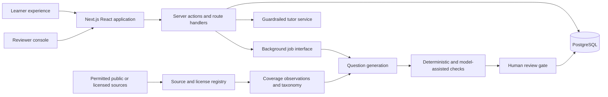

# NuraPrep

> An independent, open-source TEAS Math preparation platform built around explainable practice, measurable mastery, and reviewable question quality.

[](https://github.com/Ishan-Wakade/nuraprep/actions/workflows/ci.yml)
[](https://github.com/Ishan-Wakade/nuraprep/actions/workflows/codeql.yml)
[](LICENSE)

NuraPrep is being built for nursing-school applicants who want to understand what to study, practice deliberately, and see honest uncertainty around their progress. The first release is limited to Math. Reading, Science, and English and Language Usage will be added only after the Math experience is working and reviewed.

NuraPrep is not affiliated with, endorsed by, or sponsored by Assessment Technologies Institute, L.L.C. (ATI). ATI TEAS is a trademark of its owner. Questions published by NuraPrep must be original and are described as TEAS-aligned only after internal review against a documented content outline.

## Project status

**Career-fair MVP deployment candidate — external-service verification remains open.** The local learner bank now contains 470 active original Math families across all 12 current leaf skills: a source-controlled 38-question owner-reviewed foundation plus 432 no-cost deterministic variants released under an explicit owner-delegated MVP decision. Every exact version has governed public-outline provenance, typed answer contracts, programmatic math verification, internal similarity screening, and a versioned publication record. The generated expansion is owner-authorized and machine-validated; it has not received independent educator review or learner-performance calibration. The product includes topic practice, a coverage-aware diagnostic, versioned adaptive scheduling, 38-question timed tests, transparent readiness estimates, learner reports, account controls, and a reviewer console. Vercel, Neon, and Google production configuration and public smoke testing remain open.

| Area                                        | Status                                                                                                                                             |
| ------------------------------------------- | -------------------------------------------------------------------------------------------------------------------------------------------------- |
| Public repository and engineering standards | Complete                                                                                                                                           |
| Math taxonomy and question data model       | Implemented with migrations and seed data                                                                                                          |
| Reviewer and provenance workflow            | Review, publication, coverage gaps, reports, pattern search, and approved improvement plans working locally                                        |
| Topic practice                              | Working local multi-format vertical slice                                                                                                          |
| Diagnostic                                  | Working local flow with explicit coverage and starting signals                                                                                     |
| Adaptive mode                               | Working local, inspectable rules baseline                                                                                                          |
| Timed Math practice test                    | Working with 470 active local families; independent educational QA and empirical calibration remain open                                           |
| Score estimate and study plan               | Working, versioned baseline; external calibration remains open                                                                                     |
| Source and generation controls              | Registry, deterministic dry-run/draft staging, leased request queue, and worker gates working; paid provider intentionally off                     |
| Account and Google sign-in                  | Sessions, logout, device revocation, export, learner erasure, privileged pseudonymization, and roles implemented; real callback awaits credentials |
| Billing                                     | Stripe-hosted integration implemented fail-closed; sandbox verification and product decisions remain open                                          |
| AWS deployment                              | Terraform validated; region cost review, prerequisites, staging apply, and restore drill remain                                                    |

## Product preview


The interface shown is a product-direction preview. The example readiness state and learning plan are illustrative, not live learner results or an ATI score.

### Working local flow


These screens are backed by the local PostgreSQL practice flow. The local bank currently exposes 470 approved versions. The diagnostic samples one current published item per available skill and labels every result as preliminary; it does not infer mastery from one answer. A learner can report an answered item, and the owner can append an auditable triage decision against that exact question version and attempt. The owner workspace searches learner and reviewer evidence together and summarizes recurring categories or stable issue codes without erasing source attribution.


## Engineering highlights

- **Publication safety:** immutable question versions, independent reviewer attestations, versioned validator rubrics, and a database-enforced learner publication boundary.
- **Reproducible release content:** a typed 38-family reviewed snapshot plus a deterministic, replay-safe 432-family expansion release reconstruct the exact MVP policy without pretending machine checks are independent educational review.
- **Deterministic educational checks:** typed answer contracts plus programmatic math, formatting, uniqueness, distractor, and originality signals instead of LLM-only grading.
- **Reviewable scale:** deterministic template anchors, finite-population defect-detection planning, and extra higher-risk format samples reduce repetitive review without inheriting approval across variants.
- **Accessible visual questions:** shared semantic table rendering and responsive SVG bar graphs include exact-value table alternatives without adding a charting dependency.
- **Inspectable personalization:** prerequisite-aware diagnostic signals, adaptive scheduling reasons, spaced-review dates, and versioned score-estimate inputs remain explainable.
- **Privacy-aware accounts:** database sessions, revocable roles, fresh-session export and learner erasure, second-admin privileged pseudonymization, token-safe audit events, and shared authentication rate limits.
- **Abuse-resistant mutations:** atomic per-account budgets protect session creation, answers, review marks, tutoring, reports, predictions, exports, billing sessions, and generation requests across replicas.
- **Fail-closed billing boundary:** server-owned Stripe Checkout/Portal flows, signed replay-safe webhook receipts, order-independent subscription synchronization, and no card-data handling.
- **Production-shaped delivery:** isolated browser-test databases, transactional failure tests, a non-root standalone container, one-shot migrations, health checks, and validated cost-gated AWS Terraform.
- **Layered application security:** a tested source-restricting browser policy and hidden framework identity complement dependency alerts, secret-scanning push protection, and weekly plus change-triggered CodeQL analysis using SHA-pinned actions.

For a system-level tour, exact rebuild sequence, tradeoff analysis, and truthful interview-story framework, read the [engineering walkthrough](docs/ENGINEERING_WALKTHROUGH.md).

## Product direction

The first shippable Math release will let a learner:

1. use a development account or sign in;
2. take a short diagnostic;
3. practice by topic, difficulty, and question type;
4. receive answer-specific teaching and distractor explanations;
5. practice weak and overdue skills adaptively;
6. complete a 38-question, 57-minute Math simulation;
7. view progress and a clearly labeled, uncertain score estimate;
8. report a questionable item; and
9. let an authorized reviewer correct and approve versioned questions.

The simulation count and time reflect ATI's public TEAS Version 7 exam details as checked on September 5, 2026. NuraPrep stores exam specifications as versioned, sourced configuration so they can be reverified rather than treated as permanent constants.

## Architecture

NuraPrep starts as a modular monolith: one Next.js deployment, one PostgreSQL database, and background jobs that use a queue abstraction. This keeps transactions, authorization, and local development understandable while leaving clean extraction points if generation workloads later justify separate workers.



Important boundaries:

- Question versions are immutable. Edits create a new draft; only an approved version can enter the learner bank.
- Source material is never copied into generated questions. Acquisition requires a recorded license/terms/robots decision.
- Objective math is checked in code wherever possible. LLM review supplements deterministic checks; it does not replace them.
- Adaptive recommendations and score estimates retain their inputs, model version, explanation, and uncertainty.
- Authentication foundations protect learner and reviewer flows. Billing is disabled by default and ready for a zero-upfront-cost Stripe sandbox exercise; no learner feature is paywalled yet.

See the [engineering walkthrough](docs/ENGINEERING_WALKTHROUGH.md), [Architecture](docs/ARCHITECTURE.md), [authentication and account security](docs/AUTHENTICATION.md), [billing and entitlements](docs/BILLING.md), [container and deployment operations](docs/DEPLOYMENT.md), [incident-response runbook](docs/INCIDENT_RESPONSE.md), [launch checklist](docs/LAUNCH_CHECKLIST.md), [Adaptive model](docs/ADAPTIVE_MODEL.md), [Practice-test blueprint](docs/PRACTICE_TEST.md), [Score estimation](docs/SCORE_ESTIMATION.md), [Question model](docs/QUESTION_MODEL.md), [Validation and publication](docs/VALIDATION.md), [Content governance](docs/CONTENT_GOVERNANCE.md), [source research log](docs/SOURCE_RESEARCH_LOG.md), [generation pipeline](docs/GENERATION_PIPELINE.md), and [Roadmap](docs/ROADMAP.md).

## Technology

- Next.js 16 App Router, React 19, and TypeScript
- Tailwind CSS 4
- PostgreSQL 17 with Drizzle ORM and append-only audit records
- Database-backed sessions, account lifecycle controls, and shared authentication rate limits
- Stripe-hosted subscription boundary, disabled until sandbox or live credentials are explicitly configured
- Vitest, Testing Library, Playwright, and automated axe WCAG checks
- Docker Compose for local PostgreSQL
- No-cost deterministic variant generation with duplicate rejection and draft-only staging, plus a provider-neutral request queue whose external adapter is intentionally not configured
- Terraform 1.16 deployment root for an approval-gated AWS staging and production path

No vector database or separate API service is planned for version 1. They will be introduced only if measured product requirements justify them.

## Local development

Requirements:

- Node.js 24 LTS
- pnpm 11+
- Docker Desktop

```bash
git clone https://github.com/Ishan-Wakade/nuraprep.git
cd nuraprep
npm install --global pnpm@11.19.0 # skip when pnpm --version already reports 11.19.0
pnpm install --frozen-lockfile
cp .env.example .env.local
docker compose up -d postgres
pnpm db:migrate
pnpm db:seed
# Optional: reproduce the owner-authorized 470-question local MVP bank.
pnpm questions:mvp:release -- --confirm-owner-authorized-release
pnpm dev
```

Open [http://localhost:3000](http://localhost:3000). The account entry point is [http://localhost:3000/sign-in](http://localhost:3000/sign-in), account data and portable export are at [http://localhost:3000/account](http://localhost:3000/account), and local topic practice is at [http://localhost:3000/practice](http://localhost:3000/practice); diagnostic, adaptive, and timed-test entry points are nested beneath it. The owner review queue is at [http://localhost:3000/review](http://localhost:3000/review), with a one-per-template deterministic draft sample linked from that page, source governance at `/review/sources`, and generation controls at `/review/generation`. Optional development identities are rejected whenever `APP_ENV=production`; Google sign-in is shown only when both provider credentials are configured.

The application uses system font stacks and does not download fonts during builds or page loads. This keeps fresh-clone and container builds independent of a third-party font host while avoiding an additional runtime privacy boundary.

To exercise the production-style image locally instead, run `docker compose --profile application up --build`. This starts PostgreSQL, runs migrations once, and serves a non-root standalone Next.js container. See [Deployment and container operations](docs/DEPLOYMENT.md) for port overrides, health checks, runtime configuration, and the unprovisioned AWS plan.

## Environment variables

`.env.example` is the authoritative inventory. Variables are grouped by delivery phase, and secrets must never use the `NEXT_PUBLIC_` prefix. Its authentication value is an intentionally public local-only placeholder so a fresh clone builds without relying on a library default; production validation rejects it. Local database values are development-only, and every non-local environment needs unique credentials. Production startup requires a canonical HTTPS origin, PostgreSQL URLs, unique auth and Server Action encryption keys, and Google OAuth credentials. AWS and self-hosted deployments also require explicit reverse-proxy CIDRs; Vercel uses its platform-owned forwarding header when `DEPLOYMENT_PLATFORM=VERCEL`. Live Stripe mode is rejected outside production.

## Quality checks

```bash
pnpm format:check
pnpm lint
pnpm typecheck
pnpm test
pnpm test:db
pnpm questions:bank:audit
pnpm build
pnpm test:e2e
pnpm test:load # with the local app already running
```

`pnpm check` runs formatting, linting, type-checking, unit tests, and the production build. `pnpm test:db` requires the local PostgreSQL container. `pnpm questions:bank:audit` requires the immutable 38-question reviewed foundation to remain present and checks every additional active publication for genuine release approval, current deterministic validator passes, governed public-outline provenance, and active leaf-skill mapping. `pnpm test:e2e` derives or uses `E2E_DATABASE_URL`, refuses any database name that does not end in `_e2e`, resets only that isolated schema, and applies migrations plus seed data automatically. This keeps synthetic browser fixtures out of development and production banks. GitHub Actions provisions fresh PostgreSQL databases and runs the complete sequence on every pull request and `main` push.

The browser suite runs the full transactional and automated WCAG A/AA regression coverage in Chromium, plus read-only critical-entry smoke checks at desktop and 320-CSS-pixel widths in Chromium, Firefox, and WebKit. It also verifies skip-link keyboard behavior and the reduced-motion CSS contract. Automated analysis is a regression gate, not a substitute for a complete keyboard, screen-reader, zoom, reduced-motion, and human usability review.

The load command is a bounded local smoke test, not a benchmark claim. It refuses remote targets without an explicit opt-in and prints its workload, thresholds, status counts, throughput, and latency percentiles so results remain interpretable.

## Deployment direction

The fastest public MVP path is one Vercel-hosted Next.js application connected to a Neon PostgreSQL project, with Google OAuth enabled and billing disabled. This has no required upfront infrastructure purchase and keeps the architecture identical to local development. The validated AWS Terraform remains a separate portfolio architecture and later production option; it is not on the career-fair deployment critical path.

The validated, unapplied production target is AWS with separate staging and production environments:

- containerized Next.js application on ECS Fargate behind an HTTPS Application Load Balancer;
- PostgreSQL on RDS with encryption, automated backups, and deletion protection;
- S3 for permitted source artifacts and generated assets;
- Secrets Manager or Parameter Store for credentials;
- CloudWatch logs, alarms, and audit-friendly structured events;
- least-privilege IAM and budget alerts.

The standalone application image, migration job, Compose topology, database-aware health endpoint, and Terraform configuration are implemented and validated. The infrastructure root enforces digest-pinned images, private tasks and database subnets, production availability guards, secret injection, alarms, and an account-wide budget. No cloud resources are provisioned. A region-specific estimate, prerequisite setup, teardown review, and explicit approval are required before the first staging apply; see [deployment operations](docs/DEPLOYMENT.md).

## Security, privacy, and educational integrity

- Collect the minimum learner data needed for progress and account operation.
- Never store raw payment-card data; Stripe-hosted checkout will handle payment details.
- Keep generation prompts, answer keys, reviewer operations, and provider secrets server-side.
- Separate learner, reviewer, and administrator permissions and record sensitive review actions.
- Keep portable export, transactional learner erasure, and administrator-assisted privileged pseudonymization available; obtain legal approval for production audit-retention periods before launch.
- Describe predictions as estimates, show uncertainty, and never present them as official ATI scores.
- Require review before generated questions reach learners and provide a visible error-report path.
- Do not claim official equivalence, pass-rate improvements, or predictive accuracy without evidence.

Please report vulnerabilities through the process in [SECURITY.md](SECURITY.md), not a public issue.

## Contributing

Read [CONTRIBUTING.md](CONTRIBUTING.md) and the [Code of Conduct](CODE_OF_CONDUCT.md) before contributing. Content changes must follow the review and provenance rules; a mathematically correct answer alone is not sufficient for publication.

## License

Source code is available under the [MIT License](LICENSE). Third-party source material and question content retain their own rights and are not relicensed by this repository.

## Authoritative references

- [ATI TEAS exam details](https://www.atitesting.com/teas/exam-details)
- [ATI TEAS Version 7 content outline](https://www.atitesting.com/docs/default-source/teas-resources/ati_teas7_content_outline.pdf)

These references establish public exam structure and high-level objectives. Their inclusion does not authorize copying ATI questions or protected preparation content.
