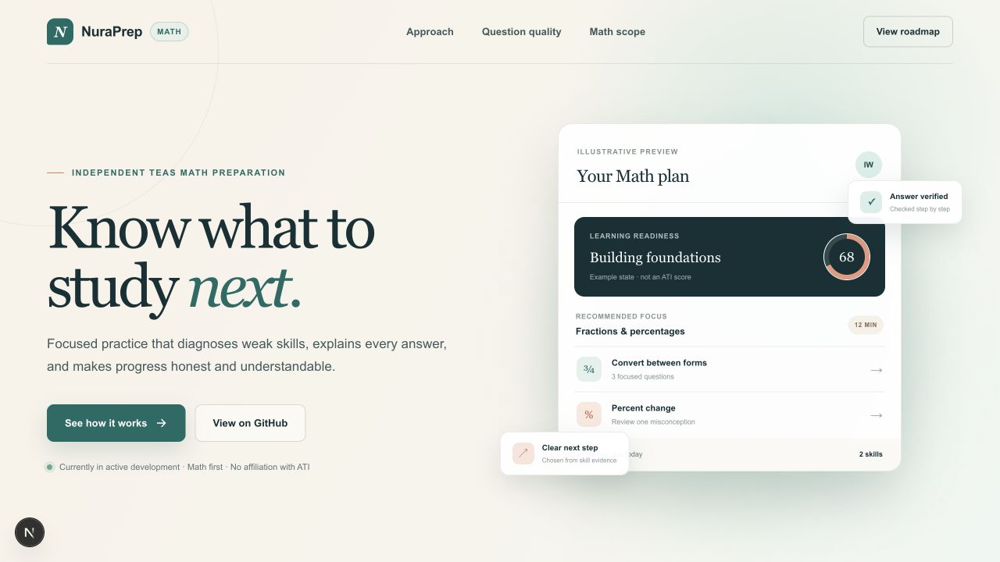
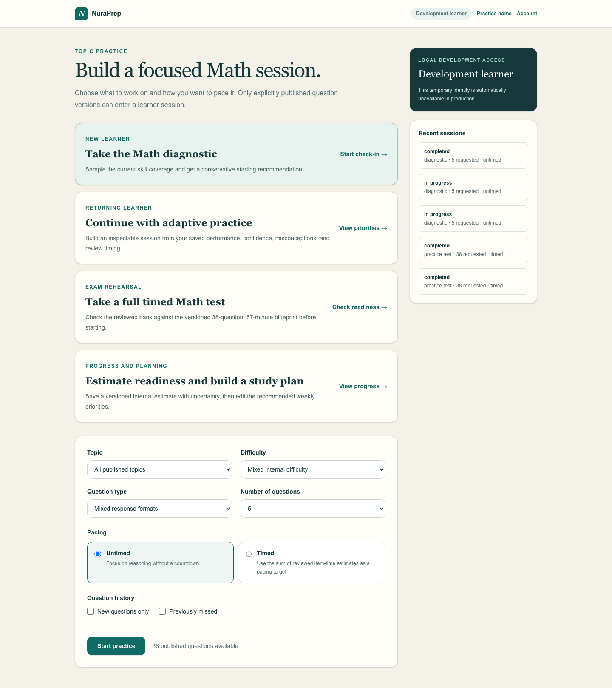
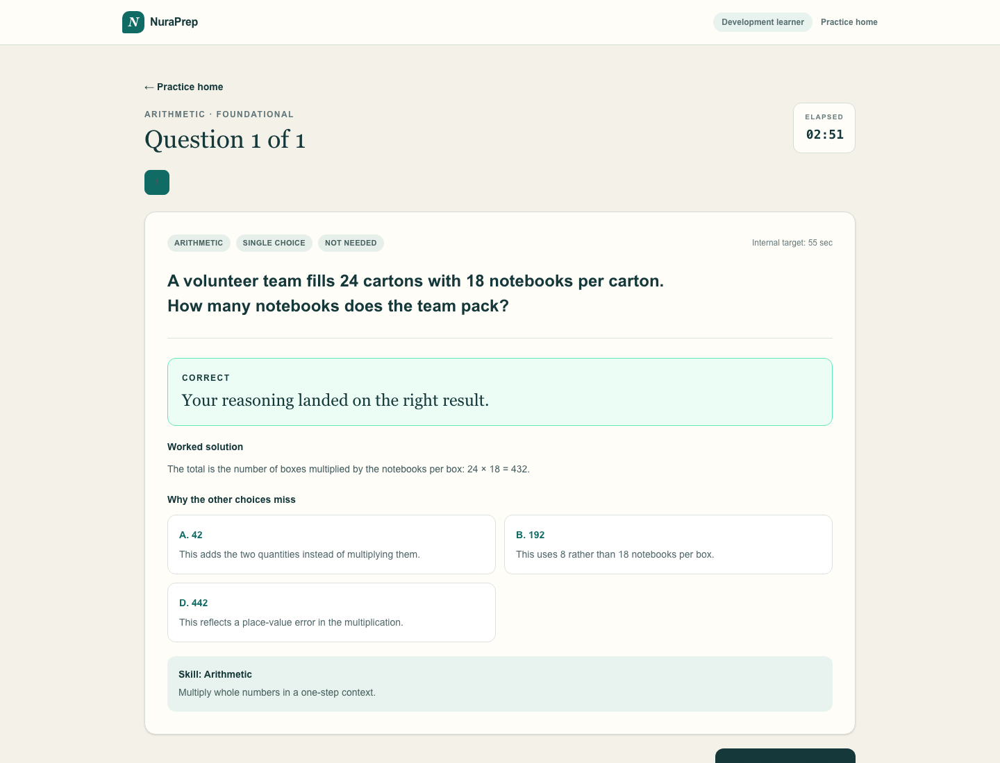
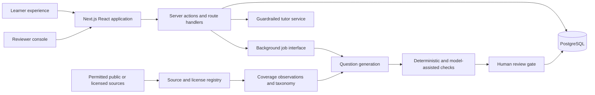

# NuraPrep

> An independent, open-source TEAS Math preparation platform built around explainable practice, measurable mastery, and reviewable question quality.

[](https://github.com/Ishan-Wakade/nuraprep/actions/workflows/ci.yml)
[](LICENSE)

NuraPrep is being built for nursing-school applicants who want to understand what to study, practice deliberately, and see honest uncertainty around their progress. The first release is limited to Math. Reading, Science, and English and Language Usage will be added only after the Math experience is working and reviewed.

NuraPrep is not affiliated with, endorsed by, or sponsored by Assessment Technologies Institute, L.L.C. (ATI). ATI TEAS is a trademark of its owner. Questions published by NuraPrep must be original and are described as TEAS-aligned only after internal review against a documented content outline.

## Project status

**Topic-practice phase — not yet a production study tool.** The repository now contains the PostgreSQL content model, deterministic answer and math checks, a local owner-review and publication workflow, and a persisted topic-practice vertical slice with reviewer-authored misconception attribution, version-linked learner reports, and owner triage. The six seed candidates remain deliberately unapproved; browser tests publish a disposable gated fixture in the local/test database. There is no approved production question bank or validated score predictor yet.

| Area                                        | Status                                                           |
| ------------------------------------------- | ---------------------------------------------------------------- |
| Public repository and engineering standards | Complete                                                         |
| Math taxonomy and question data model       | Implemented with migrations and seed data                        |
| Reviewer and provenance workflow            | Review, publication, reports, and pattern search working locally |
| Topic practice                              | Working local vertical slice; tutor next                         |
| Diagnostic and adaptive mode                | Planned                                                          |
| Timed Math practice test                    | Planned                                                          |
| Score estimate and study plan               | Planned                                                          |
| Google sign-in, billing, AWS deployment     | Deferred until the core learner experience works                 |

## Product preview



The interface shown is a product-direction preview. The example readiness state and learning plan are illustrative, not live learner results or an ATI score.

### Working local flow





These screens are backed by the local PostgreSQL practice flow. A learner can also report an answered item, and the owner can append an auditable triage decision against that exact question version and attempt. The owner workspace searches learner and reviewer evidence together and summarizes recurring categories or stable issue codes without erasing source attribution. The displayed item is a disposable browser-test fixture that passed the development validation and publication workflow; it is not production-approved content.

## Product direction

The first shippable Math release will let a learner:

1. use a development account or sign in;
2. take a short diagnostic;
3. practice by topic, difficulty, and question type;
4. receive answer-specific teaching and distractor explanations;
5. practice weak and overdue skills adaptively;
6. complete a 38-question, 57-minute Math simulation;
7. view progress and a clearly labeled, uncertain score estimate;
8. report a questionable item; and
9. let an authorized reviewer correct and approve versioned questions.

The simulation count and time reflect ATI's public TEAS Version 7 exam details as checked on September 5, 2026. NuraPrep stores exam specifications as versioned, sourced configuration so they can be reverified rather than treated as permanent constants.

## Architecture

NuraPrep starts as a modular monolith: one Next.js deployment, one PostgreSQL database, and background jobs that use a queue abstraction. This keeps transactions, authorization, and local development understandable while leaving clean extraction points if generation workloads later justify separate workers.



Important boundaries:

- Question versions are immutable. Edits create a new draft; only an approved version can enter the learner bank.
- Source material is never copied into generated questions. Acquisition requires a recorded license/terms/robots decision.
- Objective math is checked in code wherever possible. LLM review supplements deterministic checks; it does not replace them.
- Adaptive recommendations and score estimates retain their inputs, model version, explanation, and uncertainty.
- Authentication and billing are deferred so the practice and review loops can be validated first.

See [Architecture](docs/ARCHITECTURE.md), [Question model](docs/QUESTION_MODEL.md), [Validation and publication](docs/VALIDATION.md), [Content governance](docs/CONTENT_GOVERNANCE.md), and [Roadmap](docs/ROADMAP.md).

## Technology

- Next.js 16 App Router, React 19, and TypeScript
- Tailwind CSS 4
- PostgreSQL 17 with Drizzle ORM and append-only audit records
- Vitest, Testing Library, and Playwright
- Docker Compose for local PostgreSQL
- OpenAI API behind provider-neutral interfaces for reviewed generation and tutoring (later milestone)
- AWS deployment plan after the core experience is proven

No vector database or separate API service is planned for version 1. They will be introduced only if measured product requirements justify them.

## Local development

Requirements:

- Node.js 22–26
- pnpm 11+
- Docker Desktop

```bash
git clone https://github.com/Ishan-Wakade/nuraprep.git
cd nuraprep
corepack enable
pnpm install --frozen-lockfile
cp .env.example .env.local
docker compose up -d postgres
pnpm db:migrate
pnpm db:seed
pnpm dev
```

Open [http://localhost:3000](http://localhost:3000). Local topic practice is at [http://localhost:3000/practice](http://localhost:3000/practice), and the owner review queue is at [http://localhost:3000/review](http://localhost:3000/review). Their temporary development identities are rejected whenever `APP_ENV=production`.

## Environment variables

`.env.example` is the authoritative inventory. Variables are grouped by delivery phase, and secrets must never use the `NEXT_PUBLIC_` prefix. Local database values are development-only; planned integrations use separate staging and production credentials.

## Quality checks

```bash
pnpm format:check
pnpm lint
pnpm typecheck
pnpm test
pnpm test:db
pnpm build
pnpm test:e2e
```

`pnpm check` runs formatting, linting, type-checking, unit tests, and the production build. `pnpm test:db` requires the local PostgreSQL container. End-to-end tests require a migrated and seeded database. GitHub Actions provisions a fresh PostgreSQL service and runs the complete sequence on every pull request and `main` push.

## Deployment direction

The production target is AWS with separate staging and production environments:

- containerized Next.js application on ECS Fargate or App Runner;
- PostgreSQL on RDS with encryption, automated backups, and deletion protection;
- S3 for permitted source artifacts and generated assets;
- Secrets Manager or Parameter Store for credentials;
- CloudWatch logs, alarms, and audit-friendly structured events;
- least-privilege IAM and budget alerts.

No cloud resources are provisioned by this repository yet. A cost estimate, teardown plan, and explicit approval are required before deployment.

## Security, privacy, and educational integrity

- Collect the minimum learner data needed for progress and account operation.
- Never store raw payment-card data; Stripe-hosted checkout will handle payment details.
- Keep generation prompts, answer keys, reviewer operations, and provider secrets server-side.
- Separate learner, reviewer, and administrator permissions and record sensitive review actions.
- Allow account export/deletion and define retention before public launch.
- Describe predictions as estimates, show uncertainty, and never present them as official ATI scores.
- Require review before generated questions reach learners and provide a visible error-report path.
- Do not claim official equivalence, pass-rate improvements, or predictive accuracy without evidence.

Please report vulnerabilities through the process in [SECURITY.md](SECURITY.md), not a public issue.

## Contributing

Read [CONTRIBUTING.md](CONTRIBUTING.md) and the [Code of Conduct](CODE_OF_CONDUCT.md) before contributing. Content changes must follow the review and provenance rules; a mathematically correct answer alone is not sufficient for publication.

## License

Source code is available under the [MIT License](LICENSE). Third-party source material and question content retain their own rights and are not relicensed by this repository.

## Authoritative references

- [ATI TEAS exam details](https://www.atitesting.com/teas/exam-details)
- [ATI TEAS Version 7 content outline](https://www.atitesting.com/docs/default-source/teas-resources/ati_teas7_content_outline.pdf)

These references establish public exam structure and high-level objectives. Their inclusion does not authorize copying ATI questions or protected preparation content.
