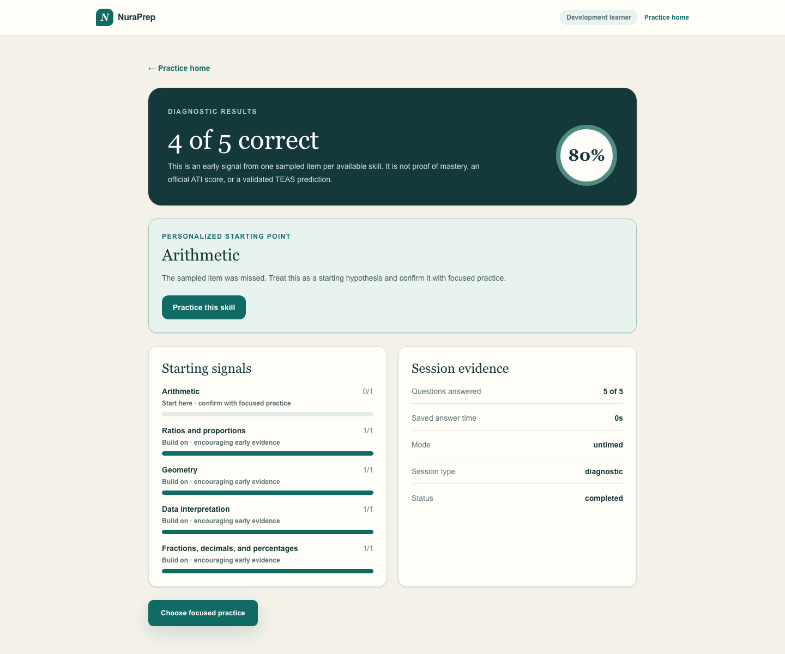
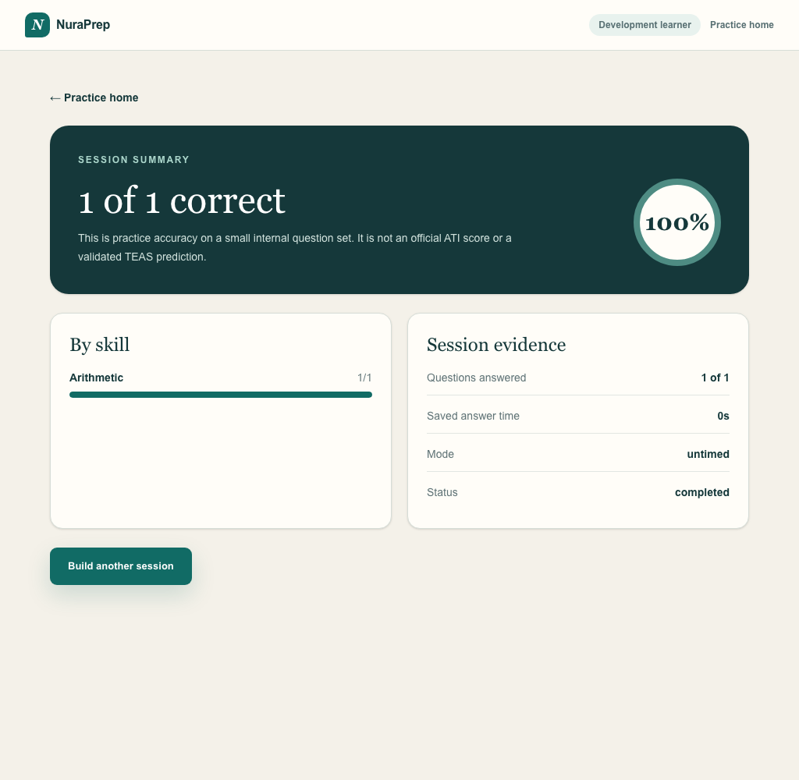
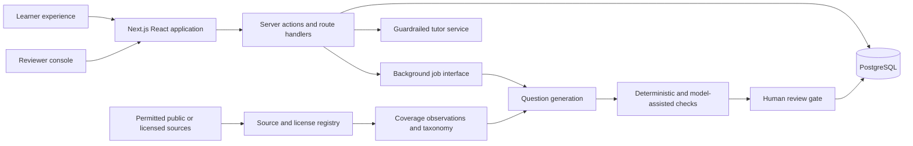

# NuraPrep

> An independent, open-source TEAS Math preparation platform built around explainable practice, measurable mastery, and reviewable question quality.

[](https://github.com/Ishan-Wakade/nuraprep/actions/workflows/ci.yml)
[](LICENSE)

NuraPrep is being built for nursing-school applicants who want to understand what to study, practice deliberately, and see honest uncertainty around their progress. The first release is limited to Math. Reading, Science, and English and Language Usage will be added only after the Math experience is working and reviewed.

NuraPrep is not affiliated with, endorsed by, or sponsored by Assessment Technologies Institute, L.L.C. (ATI). ATI TEAS is a trademark of its owner. Questions published by NuraPrep must be original and are described as TEAS-aligned only after internal review against a documented content outline.

## Project status

**Working local alpha — content review remains the release gate.** The repository contains the PostgreSQL content model, deterministic answer and math checks, owner-review and publication workflows, persisted topic practice, a coverage-aware diagnostic, a versioned rules-based adaptive scheduler, full timed-test mechanics, a transparent readiness-estimation baseline, and a fail-closed source/generation control plane. Thirty-eight original seed candidates cover every current Math leaf skill and fill the internal 20-family Numbers-and-Algebra and 18-family Measurement-and-Data targets. They remain deliberately unapproved, and browser tests use disposable, explicitly test-only approvals to verify complete learner flows. There is no approved production question bank, configured generation provider, or externally validated score predictor yet.

| Area                                        | Status                                                                                                                |
| ------------------------------------------- | --------------------------------------------------------------------------------------------------------------------- |
| Public repository and engineering standards | Complete                                                                                                              |
| Math taxonomy and question data model       | Implemented with migrations and seed data                                                                             |
| Reviewer and provenance workflow            | Review, publication, coverage gaps, reports, pattern search, and approved improvement plans working locally           |
| Topic practice                              | Working local multi-format vertical slice                                                                             |
| Diagnostic                                  | Working local flow with explicit coverage and starting signals                                                        |
| Adaptive mode                               | Working local, inspectable rules baseline                                                                             |
| Timed Math practice test                    | Mechanics verified; production bank lacks 38 approved families                                                        |
| Score estimate and study plan               | Working, versioned baseline; external calibration remains open                                                        |
| Source and generation controls              | Registry, leased request queue, and worker gates working; provider intentionally off                                  |
| Account and Google sign-in                  | Sessions, logout, device revocation, export, learner erasure, and roles implemented; real callback awaits credentials |
| Billing and AWS deployment                  | Deferred until authenticated core flows and content review are complete                                               |

## Product preview


The interface shown is a product-direction preview. The example readiness state and learning plan are illustrative, not live learner results or an ATI score.

### Working local flow




These screens are backed by the local PostgreSQL practice flow. The diagnostic samples one current published item per available skill and labels every result as preliminary; it does not infer mastery from one answer. A learner can also report an answered item, and the owner can append an auditable triage decision against that exact question version and attempt. The owner workspace searches learner and reviewer evidence together and summarizes recurring categories or stable issue codes without erasing source attribution. Displayed items are disposable browser-test fixtures; they are not production-approved content.



## Engineering highlights

- **Publication safety:** immutable question versions, independent reviewer attestations, versioned validator rubrics, and a database-enforced learner publication boundary.
- **Deterministic educational checks:** typed answer contracts plus programmatic math, formatting, uniqueness, distractor, and originality signals instead of LLM-only grading.
- **Inspectable personalization:** prerequisite-aware diagnostic signals, adaptive scheduling reasons, spaced-review dates, and versioned score-estimate inputs remain explainable.
- **Privacy-aware accounts:** database sessions, revocable roles, fresh-session export and erasure controls, token-safe audit events, and shared authentication rate limits.
- **Production-shaped delivery:** isolated browser-test databases, transactional failure tests, a non-root standalone container, one-shot migrations, health checks, and CI that builds the real image.

## Product direction

The first shippable Math release will let a learner:

1. use a development account or sign in;
2. take a short diagnostic;
3. practice by topic, difficulty, and question type;
4. receive answer-specific teaching and distractor explanations;
5. practice weak and overdue skills adaptively;
6. complete a 38-question, 57-minute Math simulation;
7. view progress and a clearly labeled, uncertain score estimate;
8. report a questionable item; and
9. let an authorized reviewer correct and approve versioned questions.

The simulation count and time reflect ATI's public TEAS Version 7 exam details as checked on September 5, 2026. NuraPrep stores exam specifications as versioned, sourced configuration so they can be reverified rather than treated as permanent constants.

## Architecture

NuraPrep starts as a modular monolith: one Next.js deployment, one PostgreSQL database, and background jobs that use a queue abstraction. This keeps transactions, authorization, and local development understandable while leaving clean extraction points if generation workloads later justify separate workers.



Important boundaries:

- Question versions are immutable. Edits create a new draft; only an approved version can enter the learner bank.
- Source material is never copied into generated questions. Acquisition requires a recorded license/terms/robots decision.
- Objective math is checked in code wherever possible. LLM review supplements deterministic checks; it does not replace them.
- Adaptive recommendations and score estimates retain their inputs, model version, explanation, and uncertainty.
- Authentication foundations now protect learner and reviewer flows; billing remains deferred until the authenticated core and reviewed content are ready.

See [Architecture](docs/ARCHITECTURE.md), [authentication and account security](docs/AUTHENTICATION.md), [container and deployment operations](docs/DEPLOYMENT.md), [Adaptive model](docs/ADAPTIVE_MODEL.md), [Practice-test blueprint](docs/PRACTICE_TEST.md), [Score estimation](docs/SCORE_ESTIMATION.md), [Question model](docs/QUESTION_MODEL.md), [Validation and publication](docs/VALIDATION.md), [Content governance](docs/CONTENT_GOVERNANCE.md), [source research log](docs/SOURCE_RESEARCH_LOG.md), [generation pipeline](docs/GENERATION_PIPELINE.md), and [Roadmap](docs/ROADMAP.md).

## Technology

- Next.js 16 App Router, React 19, and TypeScript
- Tailwind CSS 4
- PostgreSQL 17 with Drizzle ORM and append-only audit records
- Database-backed sessions, account lifecycle controls, and shared authentication rate limits
- Vitest, Testing Library, Playwright, and automated axe WCAG checks
- Docker Compose for local PostgreSQL
- Provider-neutral generation interface and auditable request queue; external provider adapter intentionally not configured
- AWS deployment plan after the core experience is proven

No vector database or separate API service is planned for version 1. They will be introduced only if measured product requirements justify them.

## Local development

Requirements:

- Node.js 24 LTS
- pnpm 11+
- Docker Desktop

```bash
git clone https://github.com/Ishan-Wakade/nuraprep.git
cd nuraprep
corepack enable
pnpm install --frozen-lockfile
cp .env.example .env.local
docker compose up -d postgres
pnpm db:migrate
pnpm db:seed
pnpm dev
```

Open [http://localhost:3000](http://localhost:3000). The account entry point is [http://localhost:3000/sign-in](http://localhost:3000/sign-in), account data and portable export are at [http://localhost:3000/account](http://localhost:3000/account), and local topic practice is at [http://localhost:3000/practice](http://localhost:3000/practice); diagnostic, adaptive, and timed-test entry points are nested beneath it. The owner review queue is at [http://localhost:3000/review](http://localhost:3000/review), with source governance at `/review/sources` and generation controls at `/review/generation`. Optional development identities are rejected whenever `APP_ENV=production`; Google sign-in is shown only when both provider credentials are configured.

To exercise the production-style image locally instead, run `docker compose --profile application up --build`. This starts PostgreSQL, runs migrations once, and serves a non-root standalone Next.js container. See [Deployment and container operations](docs/DEPLOYMENT.md) for port overrides, health checks, runtime configuration, and the unprovisioned AWS plan.

## Environment variables

`.env.example` is the authoritative inventory. Variables are grouped by delivery phase, and secrets must never use the `NEXT_PUBLIC_` prefix. Local database values are development-only; planned integrations use separate staging and production credentials. Production startup requires `BETTER_AUTH_SECRET`, `GOOGLE_CLIENT_ID`, and `GOOGLE_CLIENT_SECRET`; the auth secret must be unique per environment and at least 32 characters.

## Quality checks

```bash
pnpm format:check
pnpm lint
pnpm typecheck
pnpm test
pnpm test:db
pnpm build
pnpm test:e2e
```

`pnpm check` runs formatting, linting, type-checking, unit tests, and the production build. `pnpm test:db` requires the local PostgreSQL container. `pnpm test:e2e` derives or uses `E2E_DATABASE_URL`, refuses any database name that does not end in `_e2e`, resets only that isolated schema, and applies migrations plus seed data automatically. This keeps synthetic browser fixtures out of the development database. GitHub Actions provisions fresh PostgreSQL databases and runs the complete sequence on every pull request and `main` push.

The browser suite also runs automated WCAG A/AA checks across the public, learner, account, and reviewer entry surfaces. Automated analysis is a regression gate, not a substitute for keyboard, screen-reader, zoom, reduced-motion, and human usability review.

## Deployment direction

The production target is AWS with separate staging and production environments:

- containerized Next.js application on ECS Fargate or App Runner;
- PostgreSQL on RDS with encryption, automated backups, and deletion protection;
- S3 for permitted source artifacts and generated assets;
- Secrets Manager or Parameter Store for credentials;
- CloudWatch logs, alarms, and audit-friendly structured events;
- least-privilege IAM and budget alerts.

The standalone application image, migration job, Compose topology, and database-aware health endpoint are implemented and tested locally. No cloud resources are provisioned. A cost estimate, teardown plan, and explicit approval are required before deployment; see [deployment operations](docs/DEPLOYMENT.md).

## Security, privacy, and educational integrity

- Collect the minimum learner data needed for progress and account operation.
- Never store raw payment-card data; Stripe-hosted checkout will handle payment details.
- Keep generation prompts, answer keys, reviewer operations, and provider secrets server-side.
- Separate learner, reviewer, and administrator permissions and record sensitive review actions.
- Keep portable export and transactional learner erasure available; define production retention and administrator-assisted privileged-account erasure before launch.
- Describe predictions as estimates, show uncertainty, and never present them as official ATI scores.
- Require review before generated questions reach learners and provide a visible error-report path.
- Do not claim official equivalence, pass-rate improvements, or predictive accuracy without evidence.

Please report vulnerabilities through the process in [SECURITY.md](SECURITY.md), not a public issue.

## Contributing

Read [CONTRIBUTING.md](CONTRIBUTING.md) and the [Code of Conduct](CODE_OF_CONDUCT.md) before contributing. Content changes must follow the review and provenance rules; a mathematically correct answer alone is not sufficient for publication.

## License

Source code is available under the [MIT License](LICENSE). Third-party source material and question content retain their own rights and are not relicensed by this repository.

## Authoritative references

- [ATI TEAS exam details](https://www.atitesting.com/teas/exam-details)
- [ATI TEAS Version 7 content outline](https://www.atitesting.com/docs/default-source/teas-resources/ati_teas7_content_outline.pdf)

These references establish public exam structure and high-level objectives. Their inclusion does not authorize copying ATI questions or protected preparation content.
