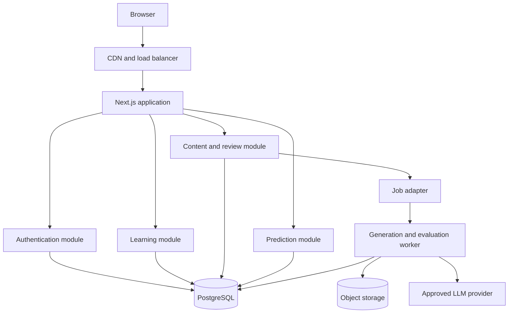
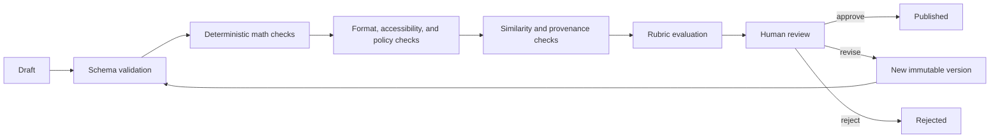

# Architecture

## Decision summary

NuraPrep will begin as a **modular monolith** built with Next.js, React, TypeScript, PostgreSQL, and a typed database layer. Learner pages, reviewer pages, APIs, and background-job orchestration live in one deployable repository. Modules communicate through typed application services rather than reaching into one another's tables.

This is the smallest architecture that supports transactional question approval, learner progress, and authorization without creating distributed-system overhead. Generation workers can be extracted later because jobs use explicit payloads and idempotency keys.

The implemented content slice uses Drizzle ORM over PostgreSQL. Database access is created lazily at request time so static pages can build without a database connection. Reviewer reads go through server-only data-access functions; every mutation rechecks reviewer authorization, validates untrusted form input, and appends a new audit record or question version.

## Runtime view

For local development, the job adapter may execute synchronously or poll PostgreSQL. Redis is not required for the first release. If queue latency, retries, or throughput become operational constraints, the adapter can move to SQS without changing domain logic.

## Modules

| Module     | Owns                                                                    | Must not own                          |
| ---------- | ----------------------------------------------------------------------- | ------------------------------------- |
| Identity   | users, sessions, roles, account deletion                                | question logic or billing truth       |
| Content    | taxonomy, sources, templates, questions, versions, validation, review   | learner ability estimates             |
| Practice   | sessions, answers, timing, reports                                      | source acquisition or question edits  |
| Learning   | skill estimates, prerequisites, scheduling, adaptive selection          | official-score claims                 |
| Assessment | diagnostic and test assembly, pacing, section rules                     | mutable question text                 |
| Prediction | versioned baseline models, estimates, uncertainty, calibration outcomes | access control                        |
| Billing    | Stripe customer/subscription synchronization, entitlements              | raw card details                      |
| Operations | jobs, audit events, error reports, monitoring                           | business rules embedded in dashboards |

## Request and data boundaries

- Server Components read through application services.
- Mutations use server actions or route handlers with the same authorization and validation layer.
- External webhooks use dedicated route handlers, signature verification, idempotency keys, and replay-safe transactions.
- Provider APIs are wrapped in interfaces. Prompts and model identifiers are stored with generation runs, while secrets remain outside the database.
- Published question payloads are selected from immutable approved versions. Draft content is unavailable to learner routes.

## Quality gates

No generated item bypasses the human gate in the first release. Failed checks are retained as structured validation results, not overwritten.

PostgreSQL triggers reject updates and deletes on question versions, validation runs, and review decisions. A revision copies the source and skill links into a new version but intentionally carries over neither validation evidence nor approval. Publication is a separate attributed ledger record; its trigger permits one controlled retirement and rejects identity changes or later history rewrites. The publication evaluator requires provenance, a latest approval, and a passing latest run for every required validator.

## Adaptive baseline

The diagnostic is the first implemented input to this layer. It assembles at most one current published question per available skill, requires at least four skills, stores the exact immutable item manifest, and derives a starting recommendation from saved correctness, confidence, and time evidence. A one-item result is deliberately called an early signal rather than mastery.

The initial adaptive selector is rules-based and inspectable:

1. estimate skill mastery with a recency-weighted beta-binomial score;
2. raise priority for prerequisite gaps, repeated misconception codes, and overdue spaced-review items;
3. require coverage across item formats and avoid recently seen question families;
4. constrain difficulty changes to one rubric level at a time unless evidence is strong; and
5. log candidate scores and the final selection reason.

The algorithm will be evaluated for learning outcomes and subgroup behavior before more complex ML is considered.

The exact current rules, constants, and limitations are recorded in [Adaptive model](ADAPTIVE_MODEL.md). They are internal product hypotheses, not ATI scoring rules, and must be changed under a new model version with regression tests.

## Timed simulation boundary

The practice-test assembler reads a versioned exam specification and only current learner-safe question publications. It blocks on domain deficits, stores a seeded immutable 38-item manifest without repeated families, and withholds answer feedback until completion. Timer recovery uses the persisted server start time; review marks are separate append-only events. See [Practice-test blueprint](PRACTICE_TEST.md) for official-versus-internal boundaries and test-fixture isolation.

## Score-estimation baseline

The first estimator combines reviewed performance by public scored domain, internal difficulty band, recency, and session evidence quality. Timed attempts retain separate accuracy and pacing features rather than receiving an arbitrary penalty. A weighted Beta baseline provides an approximate internal uncertainty interval; sparse histories remain close to a neutral prior with a deliberately wide range and an explicit low-evidence label.

This estimate is not an ATI score conversion. Estimate records are append-only; their model version, features, prediction, interval, and caveats cannot be rewritten. Study plans reference an estimate but remain editable. Eventual consented outcomes will be evaluated using mean absolute error, interval coverage, calibration curves, and named-threshold classification metrics. See [Score estimation and study planning](SCORE_ESTIMATION.md).

## Deployment evolution

1. **Local:** Next.js plus PostgreSQL in Docker; local object-storage emulator only when required.
2. **Preview:** ephemeral app preview with an isolated disposable database and synthetic content.
3. **Staging:** AWS environment with non-production OAuth, Stripe test mode, monitored jobs, and sanitized content.
4. **Production:** separate AWS account or strongly isolated environment, RDS backups, encrypted S3, least-privilege IAM, alarms, budget limits, and a tested restore path.

Production infrastructure requires a reviewed threat model, cost estimate, data-retention policy, and explicit approval.
