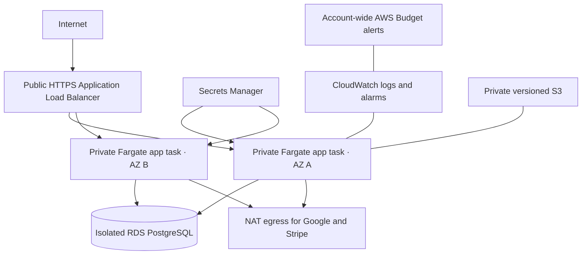

# Deployment and container operations

## Current scope

NuraPrep has a verified application image and a local Compose topology. No AWS resource has been provisioned. The production target remains a deliberately small modular-monolith deployment: one stateless Next.js container, one PostgreSQL database, and one short-lived migration job. A separate generation worker can be added only when a real provider and queue host are approved.

The container uses Next.js 16 standalone output so the runtime image contains traced production dependencies rather than the full source tree and development toolchain. It runs as the unprivileged `nextjs` user and reports only `ok` or `unavailable` from `/api/health`; database errors and connection details are never returned.

## Local workflows

For the fastest edit-refresh loop, run only PostgreSQL in Docker and Next.js on the host:

```bash
docker compose up -d postgres
pnpm db:migrate
pnpm db:seed
pnpm dev
```

To verify the deployable container topology, including the one-shot migration job:

```bash
docker compose --profile application up --build
```

This local profile deliberately runs with `APP_ENV=development`, local-only credentials, and development identities. It is not a production configuration. It applies migrations but does not seed or publish content. If port 3000 is already occupied, choose both a host port and matching public origin:

```bash
APP_PORT=3001 APP_URL=http://localhost:3001 \
  docker compose --profile application up --build
```

Inspect service state and logs with:

```bash
docker compose --profile application ps
docker compose --profile application logs app migrate postgres
curl --fail http://localhost:3000/api/health
```

Stop the application and database without deleting the database volume:

```bash
docker compose --profile application down
```

Volume deletion is intentionally not part of the normal command because it destroys local data.

## Image build and release contract

The public application origin is the only build argument; it is not a secret. Self-hosted Server Actions also require one stable base64-encoded 32-byte key. Generate it once, store it in an approved secret store, and expose it to BuildKit by environment variable name rather than value:

```bash
docker build \
  --secret id=next_server_actions_encryption_key,env=NEXT_SERVER_ACTIONS_ENCRYPTION_KEY \
  --build-arg NEXT_PUBLIC_APP_URL=https://staging.example.com \
  --build-arg NEXT_SERVER_ACTIONS_KEY_VERSION=staging-v1 \
  --target runner \
  --tag nuraprep:staging .
```

Runtime configuration must come from the deployment platform, never from an image layer. A production task requires:

- `APP_ENV=production`;
- the exact HTTPS `NEXT_PUBLIC_APP_URL` used at build time;
- a TLS-validated `DATABASE_URL`;
- a unique `BETTER_AUTH_SECRET` of at least 32 characters; and
- the same `NEXT_SERVER_ACTIONS_ENCRYPTION_KEY` used during the image build;
- environment-specific Google client credentials.

The production environment validator refuses to start with development identity switches, missing authentication configuration, a non-HTTPS/non-origin public URL, or a non-PostgreSQL database URL. Billing remains inert unless `BILLING_ENABLED=true`; when enabled, configuration must include mode-matching Stripe credentials plus the server-owned price and product IDs. Live Stripe mode is rejected outside production. AWS variables remain absent until infrastructure is approved.

Stripe sandbox testing has no AWS dependency and can be run locally using the setup in [Billing and entitlement design](BILLING.md). Never set `STRIPE_MODE=live` in a developer environment or include Stripe secrets in an image layer.

Build the temporary migration image from the same commit and run it once before shifting application traffic:

```bash
docker build \
  --secret id=next_server_actions_encryption_key,env=NEXT_SERVER_ACTIONS_ENCRYPTION_KEY \
  --build-arg NEXT_PUBLIC_APP_URL=https://staging.example.com \
  --build-arg NEXT_SERVER_ACTIONS_KEY_VERSION=staging-v1 \
  --target builder \
  --tag nuraprep-migrate:staging .

docker run --rm \
  -e APP_ENV=production \
  -e NEXT_PUBLIC_APP_URL=https://staging.example.com \
  -e DATABASE_URL \
  -e DIRECT_URL \
  nuraprep-migrate:staging pnpm db:migrate
```

`NEXT_SERVER_ACTIONS_KEY_VERSION` is a non-secret rotation label that invalidates Docker's build cache; increment it whenever the underlying protected key changes. In a real deployment, runtime secrets are injected by the orchestrator and are not written directly on a command line. The release process must stop if migration fails. Destructive rollback migrations are not automatic; application rollback must remain compatible with the migrated schema or use an explicitly reviewed forward fix.

## AWS infrastructure: validated, not applied

The Terraform root at [`infra/terraform`](../infra/terraform) defines the intended deployment. Running its formatter, provider initialization with the backend disabled, and `terraform validate` does not create resources. No NuraPrep AWS resource or recurring charge has been created.



The stack creates:

1. a two-availability-zone VPC with public load-balancer, private application, and isolated database subnets;
2. an HTTPS Application Load Balancer that redirects HTTP and can reach only port 3000 on the app security group;
3. private ECS Fargate application tasks and a separately invokable migration task;
4. encrypted PostgreSQL 17 on RDS with TLS required, automated backups, log exports, and no public endpoint;
5. a private, encrypted, versioned S3 bucket that refuses public and non-TLS access and cannot be automatically force-deleted;
6. Secrets Manager injection for generated database/auth values plus owner-supplied Google and optional Stripe values;
7. CloudWatch log retention and alarms for server errors, task/database CPU, and database free storage; and
8. an account-wide monthly AWS Budget with actual-spend and forecast notifications.

The application task role currently has no AWS data permissions. In particular, the app cannot access the S3 bucket until a real object-storage adapter exists and its exact key-level access is reviewed. This is intentional least privilege, not a claimed finished storage integration.

## Why this has no upfront cost today

Source code, local Docker development, Terraform validation, Stripe test mode, and Google OAuth development setup can all be prepared before paying NuraPrep infrastructure charges. Charges begin only if an owner explicitly applies the stack or purchases a domain. An applied stack has recurring costs even with no learners: the load balancer, NAT gateway, Fargate task, RDS instance/storage, logs, secrets, and data transfer are billable services. AWS free-tier eligibility varies by account and date and must never be assumed in a budget.

For a portfolio-only phase, keep the application local and use GitHub for the code and screenshots. This preserves the full engineering demonstration with no NuraPrep cloud bill. A publicly hosted product is a later product decision, not a prerequisite for listing the project on a resume.

## Prerequisites requiring owner input

Before the first plan that could lead to an apply, the owner must provide or approve:

- the AWS account and region, with account MFA and billing alerts enabled;
- a calculator-generated monthly estimate for the exact region and selected sizes;
- a hostname, DNS ownership, and validated ACM certificate;
- separate staging Google OAuth credentials and approved callback URL;
- one protected Server Action encryption key supplied to both BuildKit and Terraform;
- two ECR image digests built from the same reviewed commit;
- a private, versioned, encrypted Terraform-state bucket with narrow operator access;
- backup retention, deletion, incident-notification, and teardown expectations; and
- an explicit approval for the reviewed saved plan.

Stripe is not a staging prerequisite. Keep `billing_enabled = false` until the separate Stripe sandbox lifecycle and free/premium product boundary are approved.

## Validate without credentials or charges

Terraform 1.16.1 or a compatible `~> 1.16.0` release is required because generated database and auth values use ephemeral expressions and provider write-only fields.

```bash
terraform -chdir=infra/terraform fmt -check -recursive
terraform -chdir=infra/terraform init -backend=false -input=false
terraform -chdir=infra/terraform validate
terraform -chdir=infra/terraform test
```

The final command uses mocked providers to prove the private-network, recoverable-storage, billing-configuration, and production-resilience guardrails without AWS credentials. GitHub Actions performs all four checks on every pull request and main-branch push. Provider selections are committed in `.terraform.lock.hcl` for reproducibility.

## First staging release procedure

The checked-in `backend.hcl.example` and `terraform.tfvars.example` contain placeholders only. Copy them to their gitignored real names, supply secrets through protected `TF_VAR_*` environment variables where possible, and never commit a plan file or credentials.

1. Build the `runner` and `builder` Docker stages from one reviewed commit using the same protected Server Action BuildKit secret, push them to pre-created ECR repositories, and record their immutable `@sha256:` URIs.
2. Initialize the pre-created remote state backend with `terraform init -backend-config=backend.hcl`.
3. Generate a saved staging plan with `desired_task_count=0`. This creates the network and data services without starting an app against an empty schema.
4. Review the plan for exact account, region, names, counts, replacement actions, secret handling, and monthly cost. Applying requires a separate explicit owner approval.
5. After an approved apply, run the migration task in the output private subnets and app security group. Wait for it to stop and require container exit code zero.
6. Generate and approve a second plan with `desired_task_count=1` to start staging.
7. Point the approved DNS hostname at the load balancer, confirm the SNS email subscription, and verify health, Google callbacks, logs, alarms, and budget notifications.
8. Seed only reviewed staging content. Never run the development or E2E seed against staging.

Production is a separate environment. Terraform refuses production configuration unless it requests at least two app tasks, one NAT gateway per availability zone, Multi-AZ RDS, deletion protection, and a final snapshot. Those controls improve resilience but increase cost; they are not silently enabled in staging.

## Release, rollback, and database safety

Every application release must use a digest-pinned image. Run compatible forward migrations before changing application traffic. If migration fails, do not update the service. If health checks fail after an application update, the ECS deployment circuit breaker rolls tasks back, but the previous application must remain compatible with the forward-migrated schema. Database rollback is an explicitly reviewed forward fix or restore operation, never an automatic destructive migration.

Before any staging teardown, export the required database records, verify an RDS snapshot, retain legally permitted source artifacts, and identify every Terraform target in the saved destruction plan. The source bucket has `force_destroy = false`, so retained objects block accidental deletion. Production deletion protection and final snapshots are mandatory. A teardown is a separate destructive approval, not part of routine deployment.

## Cost and operational gates

AWS Budgets is a delayed notification mechanism, not a hard cap. The Terraform budget intentionally covers the whole deployment account so an untagged resource cannot evade the alert. The notification email must be correct, SNS subscription confirmation must be completed, and alerts must be tested in staging.

Before public traffic, staging must pass:

- database backup and restore drill;
- migration failure and app rollback exercise;
- least-privilege IAM and secret-rotation review;
- alarm and incident-notification test;
- load and database-connection-pool test;
- manual keyboard, screen-reader, zoom, and reduced-motion review;
- privacy, retention, account deletion, terms, and support review; and
- a fresh provider-calculator cost estimate with an accepted monthly ceiling.

Until those checks run against a real environment, describe the repository as having validated, cost-gated infrastructure code—not a deployed, production-ready AWS system.

## Repeatable load smoke test

With the local application already running, exercise health, landing, and practice reads using only Node's built-in HTTP client:

```bash
pnpm test:load
```

The default run sends 100 requests with concurrency 10, rejects any request error, and uses a deliberately loose 1,500 ms local p95 ceiling. Override the workload or threshold with `LOAD_REQUESTS`, `LOAD_CONCURRENCY`, `LOAD_TIMEOUT_MS`, `LOAD_MAX_P95_MS`, and `LOAD_MAX_ERROR_RATE`. The script prints the exact configuration, elapsed time, status counts, throughput, and nearest-rank p50/p95/p99/max latency as JSON.

The harness refuses a non-local origin unless `ALLOW_REMOTE_LOAD_TEST=true` is explicitly set. That switch is not authorization: obtain the environment owner's approval, define a safe ceiling, and observe application/database metrics before targeting staging. Local numbers vary with hardware and development mode and are not product performance claims. A real staging test must use the release image, realistic read/write distribution and data volume, a warm-up period, longer duration, and concurrent monitoring of ALB, task, database, connection-pool, and error metrics.

Use [the incident-response runbook](INCIDENT_RESPONSE.md) for containment and recovery procedures and [the launch checklist](LAUNCH_CHECKLIST.md) as the final evidence-based go/no-go gate.
