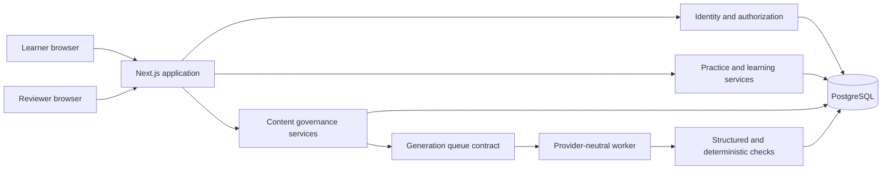
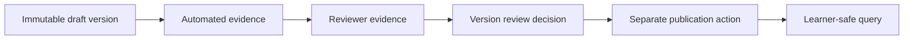

# NuraPrep engineering walkthrough

This document explains the implemented local alpha. It is written for three uses:

1. rebuilding the system from first principles;
2. preparing for technical and behavioral interviews; and
3. reviewing the tradeoffs before production decisions are made.

It is not a launch announcement. NuraPrep has a 38-family owner-approved local Math bank, but it still lacks independent educator sign-off, the depth expected of a public practice library, a configured external generation provider, live Google callback verification, verified Stripe sandbox lifecycle, an applied AWS environment, and an externally validated score predictor.

## 1. The problem the architecture is solving

A basic quiz application can store a prompt, four choices, and one answer. NuraPrep has a harder job because the learner may make consequential study decisions from its output. The system therefore has to answer several questions that ordinary CRUD applications can ignore:

- Which public outline supports the claim that a skill belongs in the product?
- Does NuraPrep have the right to store or analyze a discovered source?
- Is a question mathematically correct, unambiguous, accessible, and original?
- Which exact version did a learner answer?
- Why did the adaptive planner select that question?
- What evidence produced a readiness estimate, and how uncertain is it?
- Can a generated candidate reach a learner without an independent review?
- Can a learner export or erase private history without damaging content-safety records?

The central design decision was to treat educational integrity as a data and workflow problem, not as a sentence in the README. Important claims are backed by versioned records, explicit state transitions, database constraints, and regression tests.

## 2. Product scope and sequencing

The first release is Math-only. Reading, Science, and English and Language Usage are represented in section-level types, but no unfinished section is exposed as a learner product.

The implementation sequence deliberately followed risk:

1. establish the public repository and truthful product language;
2. model specifications, taxonomy, provenance, immutable questions, and validation;
3. build the owner-review and publication boundary;
4. build one complete topic-practice path;
5. add diagnostic, adaptive, timed-test, and score-estimation flows;
6. add controlled generation and recurring-feedback infrastructure;
7. add authentication and account lifecycle controls;
8. harden delivery, accessibility, Docker, CI, and public documentation;
9. implement fail-closed Google, Stripe, and AWS boundaries without activating paid resources; and
10. add abuse controls, privacy operations, recovery drills, and security scanning before external launch work.

This avoided a common failure mode: generating a large content bank before there was a safe way to prove, review, revise, or remove its contents.

## 3. Why a modular monolith

NuraPrep uses one Next.js application and one PostgreSQL database. Server Components read through server-only data modules, Server Actions handle form mutations, route handlers own external-style HTTP boundaries, and a provider-neutral worker module owns background generation behavior.



The modular monolith was chosen over microservices because the early product needs strong transactions more than independent scaling. Publishing a question, creating a practice manifest, completing a generated candidate, or deleting an account spans related records that are safer to update in one database transaction.

There are still extraction boundaries:

- provider adapters sit behind a generation interface;
- generation jobs have leases and idempotency independent of an HTTP request;
- content, practice, learning, prediction, identity, and future billing rules live in separate modules; and
- immutable identifiers and records can cross a queue without sharing mutable in-memory state.

If measured traffic later shows that generation consumes materially different resources, the worker can move to a separate process or SQS-backed service without splitting the learner transaction model first. The same restraint applies to Redis and a vector database: neither exists merely to make the architecture look larger.

## 4. Repository map

The repository intentionally uses a small number of top-level folders:

| Path                 | Responsibility                                                   |
| -------------------- | ---------------------------------------------------------------- |
| `src/app`            | React pages, layouts, route handlers, and Server Actions         |
| `src/data`           | Server-only data access and workflow services                    |
| `src/db/schema`      | Typed PostgreSQL schema                                          |
| `src/lib`            | Pure contracts, algorithms, validation, auth, and security logic |
| `scripts`            | Repeatable seed and transactional database smoke checks          |
| `drizzle`            | Ordered SQL migrations and schema snapshots                      |
| `e2e`                | Browser flows and disposable test-database setup                 |
| `docs`               | Architecture, policy, model, operations, and rebuild rationale   |
| `public/screenshots` | Truthfully labeled product screenshots used by the README        |
| `.github`            | CI, dependency updates, ownership, and contribution templates    |

Generated build output, local environment files, test traces, and working screenshots are ignored. Migrations and their snapshots are kept because a clean clone must be able to reproduce the database history.

## 5. The question model

### Question family versus question version

`questions` stores the stable family identity and lifecycle. `question_versions` stores immutable content. Editing never overwrites the learner-visible record; it creates version `n + 1`.

This separation solves four problems:

1. a past attempt still points to exactly what the learner saw;
2. reviewer evidence cannot silently move to edited text;
3. a correction can replace the current publication without deleting history; and
4. analytics can distinguish repeated exposure to one family from genuinely new material.

Each version stores the prompt, optional stimulus, choices, typed answer, worked explanation, distractor rationales, skill, objective, internal difficulty and rationale, estimated time, calculator policy, misconception rules, tutor guidance, authoring mode, author, and provenance summary.

### Typed answer contracts

The response type determines the answer shape:

- single choice stores one stable choice identifier;
- multiple select stores a unique set of choice identifiers;
- numeric stores a finite target, tolerance policy, and optional unit contract;
- ordered response stores one unique ordered list; and
- graph/table prompts use a typed stimulus while retaining one of the answer contracts.

Stable identifiers are used instead of array positions. Reordering choices for display therefore does not change the correct-answer identity.

Numeric parsing rejects malformed grouping and ambiguous aliases rather than guessing. For example, a malformed comma pattern is not silently stripped into a different number. Equivalent numeric distractors are also rejected even when their display strings differ.

### Deterministic math verification

The verifier does not execute arbitrary JavaScript, SQL, Python, or model-produced code. It supports a bounded data contract:

- reverse-Polish arithmetic over finite numbers and four operators;
- candidate-expression equivalence;
- ordered numeric values; and
- mean, median, and range.

The stored recipe is executed and compared with the keyed answer. This proves that the answer agrees with a declared calculation. It does not prove that the calculation faithfully represents the English prompt, so a human consistency check remains required.

## 6. Validation, review, and publication

Correctness is not one Boolean. NuraPrep separates evidence into automated and reviewer-controlled checks.

Automated evidence currently covers answer-contract validity, mathematical verification, formatting, choice uniqueness, misconception-contract validity, and conservative internal originality signals. Reviewer-only evidence covers difficulty calibration, reading level, calculator policy, explanation consistency, accessibility, topic alignment, and originality.

The publication sequence is:



A reviewer pass contains written evidence and three attestations: the exact version was inspected, the displayed active rubric was applied, and the judgment was independent rather than copied from automation or a model.

Reviewer rubrics are versioned. Replacing an active rubric retires the prior record in one transaction. Evidence recorded under the retired rubric no longer satisfies current publication readiness. This prevents a rule change from making stale evidence look current.

Publication is a separate append-only ledger. Learner queries join only the one current, non-retired publication for an active family. A draft, an approved-but-unpublished version, a retired version, or a version with incomplete evidence remains invisible even if an application bug tries to select broadly.

PostgreSQL triggers reinforce these boundaries. They reject question-version mutation, publication-history rewriting, invalid one-way transitions, and other history deletion. Application validation produces friendlier errors, while the database remains the final line of defense for scripts or future routes.

## 7. Provenance and legal safeguards

The user requirement originally used the word “scrape,” but unrestricted collection would conflict with the requirement to track rights and avoid copying. The implemented policy therefore fails closed.

Every discovered source receives metadata, an access class, a policy decision, a rationale, a reviewer, and a recheck date. The decision derives permissions; callers cannot independently check “storage allowed” while selecting a contradictory policy.

The conservative states are:

- metadata only;
- high-level coverage analysis;
- licensed storage;
- quarantined;
- excluded.

Account-gated, paid, or unclear-rights question bodies are not collected. The system does not bypass logins, paywalls, CAPTCHAs, robots controls, or rate limits. A coverage note must be a human-authored abstraction and must exclude source wording, numbers, choices, and distinctive structure.

Internal similarity checks compare NuraPrep-authored families using normalized exact text, number-invariant fingerprints, and phrase overlap. A match can block a candidate. A non-match is not advertised as legal proof of originality.

## 8. Controlled question generation

The generation system is present but its external provider is intentionally unconfigured.

### Template boundary

A template has a stable key, version, target skill, response type, difficulty, instructions, parameter constraints, prohibited patterns, and validator contract. Only an approved template may be dispatched.

Changing template content creates a new version. Draft content fields are immutable; the permitted update is a one-way status transition with approval evidence.

### Request and worker boundary

A request records its source version when applicable, scope, template, provider/model labels, prompt hash, sanitized parameters, idempotency key, cost ceiling, status, attempt count, worker claim, lease, and terminal accounting.

Workers claim rows atomically with `FOR UPDATE SKIP LOCKED`. Each claim receives a unique token and expiry. Only the current unexpired token can heartbeat or complete the job. A stale worker therefore cannot overwrite a later worker's result.

Each job has at most three attempts. Exhausted stale leases become an immutable terminal failure. Batch selection reserves the full stored worst-case ceiling, not an optimistic estimate, so a batch cannot claim more theoretical spend than its budget.

Provider output is untrusted. It must pass the complete question schema, answer contract, deterministic math contract, misconception contract, and regeneration-scope checks. Explanation-only work cannot alter the answer; distractor-only work cannot alter the correct choice. Success writes one complete draft candidate and closes the run in the same transaction.

No worker can publish its own output.

### Controlled feedback improvement

Reviewer and learner reports retain their exact question-version links. Recurring open signals can be grouped by a stable issue code. At least two matching signals are required to create an improvement proposal, and the proposal snapshots its evidence.

Proposal approval does not edit a template. For an approved generation-template proposal, a second action may fork the latest non-retired template into its consecutive draft version and record implementation plus regression evidence. PostgreSQL verifies that:

- the proposal exists, targets a generation template, and is approved;
- the output is still a draft;
- key, skill, response type, and difficulty are unchanged;
- the version increments by exactly one;
- at least one content field actually changed;
- the authenticated implementer is the recorded author; and
- the implementation ledger cannot be edited or deleted.

A third, separate action must approve the resulting template before dispatch. This makes “approve the problem,” “implement a fix,” and “enable the fix” distinct decisions.

## 9. Learner practice flow

### Session assembly

A practice session stores the learner, mode, timing policy, requested count, immutable filter snapshot, status, and timestamps. Session items store exact question-version IDs and positions. Publication changes after assembly cannot rewrite the session.

Topic practice can filter by skill, internal difficulty, response type, prior misses, unseen families, timing, and question count. The server assembles from current learner-safe publications and saves the resulting manifest.

### Answering and feedback

An answer is parsed according to the version's answer contract. The immutable attempt records the learner response, correctness, timing, confidence when supplied, and deterministic misconception matches.

After submission, the page can show:

- the correct result;
- a worked explanation;
- why each distractor is wrong;
- the underlying skill;
- deterministic misconception guidance;
- a post-answer reflection; and
- an exact-version problem-report action.

The hint-first tutor uses a bounded list of reviewer-authored Socratic questions or hints. Before an answer, the learner requests one step at a time. Each reveal is append-only. The answer is not part of the hint payload. A conversational model is deliberately deferred until prompt-injection, retention, and answer-reveal policies are implemented and tested.

### Diagnostic

The diagnostic samples current coverage and reports conservative skill signals. One response is not labeled mastery. Optional confidence is retained as evidence, prerequisite weaknesses are traversed, and the learner receives a transparent starting recommendation.

### Adaptive practice

`adaptive-baseline-v1` starts each skill with a symmetric `Beta(2, 2)` prior. Attempts decay with a 45-day half-life. Correct and incorrect evidence weights vary by internal difficulty, and confidence makes only a bounded adjustment.

Priority is the sum of bounded need, uncertainty, review-due, misconception, and prerequisite-gap components. Candidate adjustments reward unseen families and underexposed response formats while strongly penalizing recent families and abrupt difficulty jumps.

Safety constraints prevent duplicate versions, allow difficulty to move by at most one band, and prevent one skill from consuming more than half a session when alternatives exist. Every selection stores its reason and algorithm version.

These values are product hypotheses, not learned truths. A weight change requires a new version and regression case. A learned policy is unjustified until consented data can show better delayed learning, calibration, and subgroup behavior.

### Timed test

The stored specification records 38 total Math questions and 57 minutes from the reviewed public exam details. The public scored-domain counts explain 34 slots. NuraPrep allocates the four unscored slots proportionally, producing an internal 20/18 domain approximation that is explicitly not represented as official.

Assembly requires 38 distinct families and blocks on a domain deficit. A seed makes the manifest reproducible. The timer uses the persisted server start time, survives refresh, and rejects late submissions server-side. Explanations remain hidden during the test. Early submission leaves unanswered items unscored rather than fabricating wrong answers.

## 10. Readiness estimate and study plan

`score-baseline-v1` is not an ATI conversion. It uses attempts from the prior 180 days and keeps only the newest attempt per immutable family.

Each domain begins with `Beta(2, 2)`. Evidence receives a 60-day recency decay, a mode/completion weight, and a small internal difficulty adjustment. Domain estimates are combined using the reviewed public scored-domain counts, not the learner's accidental sample distribution.

Timed and untimed accuracy are displayed separately. The model does not invent a timed penalty. The interval is an approximate internal uncertainty interval, not a calibrated promise about an ATI result.

Each estimate stores its model version, point, bounds, evidence label, exact feature snapshot, and caveats as an append-only record. The study plan references that estimate and can be edited without rewriting the prediction history.

The baseline remains appropriate because no real outcome dataset exists. A more complicated ML model would add variance and opacity without evidence of better performance. Future evaluation must freeze versions and measure mean absolute error, calibration, interval coverage, threshold sensitivity/specificity, and supported subgroup behavior.

## 11. Authentication, authorization, and privacy

Better Auth provides the protocol and session foundation; PostgreSQL is the local source of truth.

The key distinction is authentication versus authorization:

- authentication establishes which local account owns the session;
- authorization checks an active database role and resource ownership near every query or mutation.

High-impact authenticated actions and append-only learner events also consume atomic fixed-window allowances in PostgreSQL. Their keys hash the principal and action scope, so horizontally scaled tasks cannot each grant a separate quota and the limiter does not retain raw email or IP data.

The reviewer UI being hidden is not a security boundary. Reviewer reads and Server Actions independently require a current `REVIEWER` or `ADMIN` grant. Learner queries include the authenticated subject in their SQL predicates.

Sessions are database-backed and revocable. Tokens remain out of page props, logs, and export files. Production uses a host-only, `Secure`, `HttpOnly`, `SameSite=Lax` session cookie with the `__Secure-` prefix. Production configuration rejects development identity switches, the public local-only auth secret, missing Google credentials, missing Server Action encryption, broad or absent proxy trust, non-HTTPS/non-origin public URLs, non-PostgreSQL database URLs, and live Stripe mode outside production.

Browser responses add defense in depth with a source-restricting Content Security Policy, blocked object/frame/base injection, disabled inline event-handler attributes, and no framework identity header. The current baseline still permits inline script and style blocks needed by static Next.js hydration. A strict per-request nonce would force every page to render dynamically and remove CDN caching, while the framework's integrity alternative is experimental; staging must evaluate that cost and compatibility before claiming a strict CSP.

Application mutation limits are stored atomically in PostgreSQL rather than process memory. This means ten application replicas still share one allowance. The key is a SHA-256 derivation of action scope and account principal, so the limiter does not retain the raw email, user ID, or address it protects. Expired rows are pruned incrementally to avoid requiring a separate cleanup service.

The account page supports:

- coarse signed-in-device visibility;
- revocation of every other session while preserving the current one;
- a fresh-session-gated portable export that excludes credentials and answer keys;
- fresh-session plus typed-confirmation learner erasure; and
- second-administrator privileged-account pseudonymization that preserves opaque content attribution while removing credentials and learner data.

Erasure runs in one PostgreSQL procedure. It removes learner-owned history in dependency order and writes a non-identifying receipt. A smoke test injects a failure near the end and proves the transaction restores preceding deletions. Accounts with reviewer/admin history are refused by self-service deletion because their internal IDs can be part of immutable safety records. Their separate path requires a fresh session, exact email confirmation, a written reason, and a second active administrator; it deletes credentials and learner history, revokes roles, and retains a disabled `Former reviewer` tombstone. This is explicitly pseudonymization, not anonymization, and its production retention basis still requires legal review.

## 12. Billing boundary without live billing

Stripe is integrated as a disabled, server-owned boundary. The browser never receives a secret key and NuraPrep never handles card details. Checkout and customer-portal sessions are created only for an authenticated local account, against server-configured product and price identifiers.

Webhook processing bounds the raw body, verifies its signature before parsing, and persists Event IDs idempotently so replay cannot apply a second transition. For every supported event, NuraPrep re-fetches the current Subscription from Stripe instead of treating an out-of-order webhook payload as current state. Entitlements deny by default when billing is disabled, unconfigured, missing, or not in an allowed subscription state.

Configuration keeps test and live modes explicit. Live credentials are rejected outside `APP_ENV=production`, and production can still run in Stripe test mode for a controlled launch drill. This build did not create any Stripe product, customer, price, or webhook endpoint, and no feature has been paywalled.

## 13. Accessibility, recovery, and interface decisions

The visual identity uses calm teal, warm neutral surfaces, readable serif display headings, and restrained progress cues. Copy is encouraging without suggesting a guaranteed score.

The interface includes visible labels, keyboard-operable controls, a skip link, focus styles, semantic landmarks, responsive layouts, accessible table descriptions, and reduced-motion handling. Color contrast was measured rather than judged by appearance alone.

Automated axe scans cover public, sign-in, practice, diagnostic, adaptive, timed-test, progress, account, reviewer, and not-found surfaces. Workflow tests also scan dynamic hint, answer-feedback, summary, provenance, and template-improvement states.

Unexpected route failures render a retry action and a safe link back to Math practice without exposing the thrown message. A separate root fallback owns its entire HTML document because it must still render when the root layout fails. Unknown URLs return a real 404 with useful navigation instead of the framework default.

Automation cannot prove screen-reader comprehension, zoom usability, mathematical pronunciation, or cognitive clarity. Manual assistive-technology review remains a launch condition.

## 14. Testing strategy

The test pyramid is organized by failure cost.

### Pure unit tests

Vitest covers answer parsing, numerical evaluation, adaptive priorities, diagnostic summaries, score estimation, generation contracts, retries, environment validation, authorization mapping, and controlled-improvement schemas. These tests are fast and make algorithm changes easy to localize.

### Database smoke tests

The database smoke script opens one transaction, creates valid temporary records, attempts forbidden mutations or transitions, and rolls everything back. It verifies behavior that an ORM type checker cannot prove: triggers, partial uniqueness, append-only history, one-way state machines, generation leases, cost constraints, evidence minimums, proposal implementation rules, account erasure rollback, and foreign-key order.

### Browser tests

Playwright tests complete real workflows through rendered pages and Server Actions. The setup derives a sibling database ending in `_e2e`, refuses to reset any other name, drops only that isolated schema, migrates, seeds, and creates explicitly test-only publications. This prevents browser fixtures from contaminating development or being mistaken for reviewed content.

The suite covers learner practice, diagnostic, adaptive selection, 38-item timed tests, estimates, reviewer revision/publication behavior, source governance, feedback proposals, generation controls, authentication, export, revocation, deletion, response headers, mobile overflow, and accessibility.

### CI, security, container, and recovery verification

GitHub Actions starts PostgreSQL and runs Terraform formatting, validation, guardrail tests, application formatting, linting, type checking, unit tests, migration and database checks, a production build, a container build, and browser tests. A separate CodeQL workflow scans JavaScript and TypeScript on changes and weekly using SHA-pinned actions and extended security queries. Dependabot covers npm, GitHub Actions, and Docker; secret-scanning push protection is enabled.

The Dockerfile builds a Next.js standalone server and runs it as a non-root user. Compose supplies a one-shot migration service before the application starts and exposes a database-aware health route. The application pool has explicit connection, statement, client-query, idle-transaction, idle-connection, and connection-lifetime bounds; staging still needs to prove those values against its real task and RDS connection budgets.

The unapplied Terraform target uses an HTTPS load balancer, private Fargate tasks, isolated encrypted PostgreSQL, Secrets Manager injection, a private source-artifact bucket, bounded logs, operational alarms, and an account budget. Production input guards require multiple application tasks, Multi-AZ RDS, deletion protection, a final snapshot, and one NAT gateway per availability zone. Those safeguards intentionally make production more expensive than staging; no plan or apply is authorized until the owner sees a region-specific cost and exact resources.

A bounded local load harness refuses remote targets without explicit opt-in and reports status distribution, throughput, and latency percentiles without turning a development-machine run into a product benchmark. Recovery checkpoints contain a complete Git bundle plus a custom-format PostgreSQL dump. The dump was restored into an isolated database and queried before cleanup. A second drill cloned the public repository into a new directory, installed the exact lockfile, migrated and seeded disposable databases, and ran the full static, unit, database, build, and browser gates.

## 15. Important setbacks and what changed

These are useful interview examples because they show correction rather than a frictionless story.

### Seed content versus production truth

The system needed enough content to exercise every flow before human review, but marking AI-assisted seed content approved would have created a false safety claim. The initial resolution was to keep 38 candidates in draft and let Playwright create disposable test-only approval evidence in an isolated database. The owner later reviewed the real bank, recorded genuine decisions, and published the exact validated versions through the normal UI; test evidence remained excluded.

The next issue was reproducibility: those decisions initially existed only in the development database and backup, so a GitHub clone could not reconstruct the reviewed state. A typed, source-controlled bank snapshot now preserves the exact current content and latest genuine decisions, while fresh seeding recomputes deterministic evidence before publication. The complete append-only history remains a database-backup concern rather than being misrepresented by the snapshot.

Lesson: testability does not justify weakening the production state model.

### Concurrent database work

A new proposal-implementation action initially issued parallel queries on one PostgreSQL transaction connection. The driver warned that this behavior is deprecated. The queries were made sequential while independent page-level reads kept safe pool-level parallelism.

Lesson: concurrency is a property of the underlying connection, not just JavaScript promises.

### Dynamic action feedback

An end-to-end test first expected a transient Server Action success message after revalidation. The durable result card was present, but the ephemeral action state disappeared when the server-rendered page refreshed. The assertion was changed to verify persisted implementation state and the linked draft.

Lesson: tests should prefer durable user outcomes over incidental rendering timing.

### Dependency automation

Dependabot produced a valid accessibility-tool update whose CI failed only because its generated lockfile did not match repository formatting. The update was applied on `main`, the lockfile was formatted, accessibility tests passed, and the superseded red PR was closed with an explanation.

Lesson: automation still needs repository-specific integration and clean public maintenance signals.

### Docker and Next.js runtime shape

A normal development build is not the same artifact as a small production container. The application adopted Next.js standalone output, copied only public and standalone/static assets into the runner stage, and used a dedicated non-root account.

Lesson: build success is incomplete until the actual deployment artifact is built and exercised.

### Clean-clone authentication defaults

A backup clone passed installation but the first production build failed because required origin/database values were absent. Repeating the documented `.env.example` step allowed the build, but Better Auth then emitted warnings because it fell back to its public default secret.

The example now contains an explicitly public local-only value so copy-and-run development is quiet and deterministic. Production validation rejects that exact value. This preserves a good onboarding path without teaching users to treat a checked-in placeholder as a real secret.

Lesson: fail-closed configuration and smooth local setup are compatible when environment intent is explicit.

### Parallel receipt assertion

The public-clone browser drill exposed a flaky account-erasure assertion. The learner test counted every deletion receipt while the privileged-pseudonymization test could append a different receipt in parallel. The product transactions were correct; the test had asserted global state.

The check was narrowed to the ordinary-erasure receipt version, then the complete suite passed twice from fresh E2E resets. The receipt remains non-identifying rather than adding a user ID merely to simplify a test.

Lesson: concurrent integration tests must isolate evidence without weakening the production privacy model.

## 16. Rebuilding NuraPrep from scratch

This is the recommended order if recreating the project rather than copying its files.

### Phase A: establish the application and quality floor

1. Create a TypeScript Next.js App Router project with Tailwind.
2. Pin a supported Node major and package-manager version.
3. Add Prettier, ESLint, Vitest, Testing Library, Playwright, and axe.
4. Add CI before product code so every later milestone inherits the gate.
5. Add repository governance, contribution, security, and license files.

Definition of done: a clean clone installs reproducibly, renders one honest page, and passes formatting, linting, type checking, unit tests, a production build, and one browser test.

### Phase B: design the content boundary

1. Start PostgreSQL locally.
2. Define section, domain, topic, skill, and prerequisite records.
3. Define source policy and recheck history before any acquisition code.
4. Separate question family from immutable question version.
5. Define typed answer, stimulus, misconception, tutor, and verification contracts.
6. Add validators and database immutability triggers.
7. Add review evidence, decisions, and publication as separate entities.

Definition of done: direct SQL cannot mutate a version or publish incomplete evidence, and learner data access has no draft path.

### Phase C: build one vertical learner slice

1. Create a development learner identity that production configuration rejects.
2. Assemble and persist one topic-practice session from publications.
3. Render each supported response type.
4. Parse and score on the server.
5. Show worked feedback only after submission.
6. Add exact-version reporting and reviewer triage.

Definition of done: one browser test creates a learner-safe fixture, answers it, sees feedback, and reports it.

### Phase D: add learning modes as versioned algorithms

1. Add diagnostic coverage and conservative skill signals.
2. Add adaptive estimates, priorities, diversity constraints, and reason logs.
3. Store a sourced exam specification and build a reproducible timed-test manifest.
4. Add a transparent score baseline and append-only estimates.
5. Keep constants in named model versions with evaluation cases.

Definition of done: seeded histories produce deterministic, explainable outputs and boundary cases fail clearly.

### Phase E: add content operations

1. Add approved generation templates and idempotent requests.
2. Add worker claims, leases, token fencing, retries, and budget ceilings.
3. Validate complete untrusted output before persistence.
4. Add recurring feedback, evidence-backed proposals, and separately reviewed implementation versions.
5. Keep the provider off until privacy, legal, cost, and abuse tests are ready.

Definition of done: a fake provider can complete one valid candidate, malformed output cannot persist, and no result can self-publish.

### Phase F: add real identity and account lifecycle

1. Integrate an authentication library rather than hand-writing OAuth.
2. Store sessions and role grants in PostgreSQL.
3. Recheck ownership and role in every server mutation.
4. Add session revocation, export, and deletion transactions.
5. Add second-admin pseudonymization for privileged attribution.
6. Add shared database-backed limits for sensitive mutations.
7. Test cookie and production configuration fail-closed behavior before using credentials.

Definition of done: learner isolation, reviewer denial, token exclusion, revocation, export, deletion, and rollback are browser/database tested.

### Phase G: package and operate

1. Build standalone output in a multi-stage Dockerfile.
2. Run as non-root.
3. Add a one-shot migration job and health endpoint.
4. Separate development, E2E, staging, and production databases.
5. Bound pool connections, query time, transaction idle time, and connection lifetime.
6. Add accessible route, global-error, and not-found recovery.
7. Add dependency, secret, and CodeQL scanning.
8. Encode cloud boundaries as validated Terraform without applying them.
9. Run local backup/restore and clean-clone drills.
10. Apply staging only after cost, restore, IAM, retention, and teardown plans receive explicit approval.

### Exact local reproduction

```bash
git clone https://github.com/Ishan-Wakade/nuraprep.git
cd nuraprep
corepack enable
pnpm install --frozen-lockfile
cp .env.example .env.local
docker compose up -d postgres
pnpm db:migrate
pnpm db:seed
pnpm check
pnpm test:db
pnpm test:e2e
pnpm dev
```

Open `http://localhost:3000`. The normal development seed intentionally has no learner-safe publication, so use the reviewer workflow to approve content or rely on the isolated E2E setup for disposable complete-flow fixtures.

To verify the deployment-shaped image:

```bash
docker compose --profile application up --build
```

## 17. Behavioral interview preparation

Use these as truthful story structures, not scripts to memorize. Replace “I” claims with what you personally decided, reviewed, tested, or implemented. If AI tools helped write code, describe them as engineering tools and be ready to explain how you validated the result. Do not claim adoption, revenue, accuracy, or user outcomes that do not exist.

### Story 1: handling ambiguous requirements

**Situation:** The product needed broad TEAS-style coverage and mentioned scraping public questions, while also requiring originality and license tracking.

**Task:** Create a scalable content pipeline without copying protected material or building an unverifiable question dump.

**Action:** Separate discovery metadata, rights decisions, human-authored coverage abstraction, internal generation, deterministic validation, human review, and publication. Default unclear sources to quarantine and prevent source question text from entering model input.

**Result:** The repository can track coverage and provenance while generated or seeded candidates remain blocked until independent review. The honest limitation is that the production bank is still unapproved.

**Follow-up question to expect:** Why not rely on semantic similarity alone? Explain that similarity is an imperfect rejection signal, legally retained comparison text may be limited, and human review remains necessary.

### Story 2: choosing simplicity over resume-driven complexity

**Situation:** The proposed stack allowed a separate API, Redis, a vector database, and several cloud services.

**Task:** Build a technically credible system that one engineer can operate and explain.

**Action:** Choose a modular Next.js/PostgreSQL monolith. Keep provider and queue interfaces, but do not deploy Redis or a vector database without measured need.

**Result:** Strong transactions and local reproduction are straightforward, while generation workers retain an extraction path.

**Follow-up question to expect:** When would you split the worker? Answer with measured queue latency, CPU/memory isolation, retry throughput, deploy cadence, and independent scaling—not an arbitrary user count.

### Story 3: protecting integrity under delivery pressure

**Situation:** Complete learner flows needed 38 questions, but the available candidates had not received genuine owner/educator approval.

**Task:** Test the timed product without misrepresenting content readiness.

**Action:** Keep normal seed candidates draft. Build an isolated `_e2e` database that creates clearly labeled synthetic approval fixtures and refuses to reset a database without the safety suffix.

**Result:** The 38-question experience is tested end to end without contaminating development or claiming a production bank.

**Follow-up question to expect:** Why not mock the database? Explain that mocks would miss triggers, transaction behavior, query scoping, timer persistence, and publication joins.

### Story 4: debugging a difficult integration issue

**Situation:** A transaction worked but emitted a PostgreSQL warning about concurrent queries on one client.

**Task:** Remove a future compatibility risk without discarding useful concurrency elsewhere.

**Action:** Trace the warning to `Promise.all` inside one transaction, make those reads sequential, and retain parallel reads only where the pool can use separate connections. Rerun targeted and full browser suites.

**Result:** The workflow passed without the deprecation warning.

**Follow-up question to expect:** Why use an advisory lock too? Explain that the lock serializes revisions sharing a template key, while the unique index remains a final race boundary.

### Story 5: designing explainable ML before data exists

**Situation:** The product needed adaptive practice and score prediction but had no consented learner-outcome dataset.

**Task:** Provide useful personalization without pretending an untrained complex model is accurate.

**Action:** Build versioned Bayesian-style heuristic baselines with recency weighting, bounded difficulty/confidence adjustments, prerequisite traversal, diversity constraints, and explicit uncertainty. Define future calibration metrics before collecting outcomes.

**Result:** Recommendations are reproducible and inspectable. Predictive validity remains explicitly unproven.

**Follow-up question to expect:** What would justify ML? Explain learner-level holdouts, improved calibration/MAE, interval coverage, subgroup checks, privacy review, and an interpretable fallback.

### Story 6: privacy and deletion

**Situation:** Learner history spans attempts, tutor use, reports, estimates, plans, sessions, and account records, while reviewer records must remain auditable.

**Task:** Make self-service erasure complete and transactional without corrupting content history.

**Action:** Build one database procedure with narrow deletion-context controls, remove learner-owned dependencies in order, refuse privileged-history accounts from self-service erasure, and write a non-identifying receipt. For privileged requests, require a second active administrator, remove credentials and learner history, revoke roles, and retain only a disabled pseudonymous tombstone linked to immutable content attribution. Inject a late failure in a smoke test to prove ordinary-erasure rollback and use browser/database assertions to verify the privileged path.

**Result:** Ordinary learner erasure is atomic and tested. Privileged pseudonymization is also implemented and tested, while the audit-retention period and legal basis remain explicit launch decisions.

**Follow-up question to expect:** Why retain a receipt? Explain operational proof without retaining an identifier or deleted content.

### Story 7: finding failures through reproducibility

**Situation:** Local and GitHub checks were green, but the repository still had to prove that a new contributor could start from public artifacts rather than the maintainer's configured machine.

**Task:** Verify recovery and onboarding without touching reviewed development data.

**Action:** Create and verify a complete Git bundle, dump PostgreSQL in a portable custom format, restore it into an isolated database, then clone the public repository into a new temporary directory. Use separate disposable database names for migrations, seeds, and browser tests. The drill found both the local auth-secret warning and a parallel receipt-count assertion.

**Result:** The supported setup path is reproducible, the backup is proven restorable, and the two discovered defects have regression coverage. No claim is made that RDS restore or production disaster recovery is proven.

**Follow-up question to expect:** Why not just trust CI? Explain that CI verifies a checkout under prepared environment variables, while a recovery drill also tests public visibility, documentation order, backup format, clean database creation, and hidden local-state assumptions.

## 18. What is not complete

The following must not be described as shipped:

- independent educator sampling and final public-launch approval of the owner-published Math bank;
- independent approval of the engineering-draft gold evaluation set;
- live Google callback behavior with real credentials;
- a provider-backed conversational tutor;
- a configured question-generation provider and production queue schedule;
- calibrated originality thresholds against a legally usable benchmark;
- a configured Stripe sandbox, verified subscription lifecycle, approved premium feature boundary, or live billing;
- an applied AWS environment, RDS backup/restore drills, live monitoring, or provider-calculator cost validation;
- manual screen-reader and assistive-technology review; and
- external calibration or claimed accuracy of the readiness estimate.

The strongest accurate description is: **a working local TEAS Math alpha with an owner-approved 38-family bank, production-shaped content governance, learner workflows, explainable personalization, no-cost deterministic expansion drafts, authentication and billing foundations, validated cost-gated infrastructure code, and automated quality gates; educational calibration and external services remain pre-production.**

## 19. Glossary

| Term                   | Meaning in NuraPrep                                                      |
| ---------------------- | ------------------------------------------------------------------------ |
| Question family        | Stable conceptual item identity across revisions                         |
| Question version       | Immutable prompt, answer, explanation, metadata, and provenance snapshot |
| Publication            | Separate ledger record making one eligible version learner-safe          |
| Validator rule         | Versioned definition of one publication requirement                      |
| Validation run         | Evidence for one rule against one exact question version                 |
| Generation template    | Versioned constraints for creating a candidate                           |
| Generation run         | Idempotent, leased, budgeted request producing at most one draft         |
| Improvement proposal   | Immutable evidence-backed plan addressing recurring feedback             |
| Implementation record  | Immutable link from an approved proposal to a new draft template version |
| Adaptive estimate      | Internal heuristic learning signal, not a calibrated mastery probability |
| Readiness estimate     | Internal, uncertain practice estimate, not an ATI score                  |
| Development identity   | Local-only learner or reviewer bypass rejected in production             |
| Privileged tombstone   | Disabled pseudonymous row retaining internal content-attribution joins   |
| Entitlement projection | Local replay-safe view of Stripe subscription state; denies by default   |
